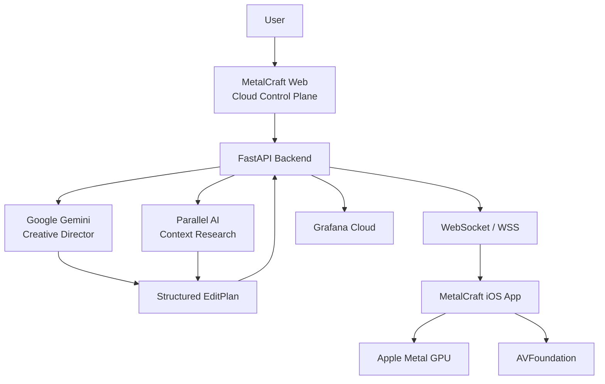

# MetalCraft

<p align="center">
  
</p>

<h1 align="center">MetalCraft</h1>

<h3 align="center">AI Directs. Metal Crafts.</h3>

<p align="center">
  An agentic AI-powered media production system combining Google Gemini,
  Parallel AI, Apple Metal GPU, native iOS, and a cloud control plane.
</p>

<p align="center">

  

  

  

  

  

  

  

  

</p>

<p align="center">
  <a href="#overview">Overview</a> •
  <a href="#why-metalcraft">Why MetalCraft</a> •
  <a href="#architecture">Architecture</a> •
  <a href="#agentic-pipeline">Agentic Pipeline</a> •
  <a href="#ios-application">iOS Application</a> •
  <a href="#cloud-control-plane">Cloud Control Plane</a> •
  <a href="#technology-stack">Tech Stack</a> •
  <a href="#deployment">Deployment</a>
</p>

---

## 🌐 Live Project

**Website:**  
[MetalCraft Cloud Control Plane]([https://metalcraft-olso.onrender.com](https://metalcraft-ols0.onrender.com/))

---

# 📸 Project Preview

## Web Cloud Control Plane

> 

---

## 📱 MetalCraft iOS Application

> 

---

# Overview

**MetalCraft** is an **agentic AI-powered media production system** designed around one core idea:

> ## AI Directs. Metal Crafts.

MetalCraft combines **cloud-based AI intelligence** with **native iOS GPU execution**.

Instead of treating AI as simply a chatbot or an editing assistant, MetalCraft uses AI as a **creative director** that understands the user's intent, researches context, produces a structured production plan, and orchestrates execution on Apple hardware.

The cloud handles:

- Creative reasoning
- Context research
- Edit planning
- Pipeline orchestration
- Device management
- Job dispatch
- Telemetry
- Audit information

The iPhone handles:

- Local media access
- Image processing
- Video processing
- GPU effects
- Color grading
- Timeline composition
- Audio synchronization
- Final rendering

The architecture can be summarized as:

```text
                USER
                  │
                  ▼
       ┌──────────────────────┐
       │ MetalCraft Web       │
       │ Cloud Control Plane  │
       └──────────┬───────────┘
                  │
                  ▼
       ┌──────────────────────┐
       │    Agentic AI Layer  │
       │                      │
       │ Gemini + Parallel    │
       └──────────┬───────────┘
                  │
                  ▼
       ┌──────────────────────┐
       │ Structured EditPlan  │
       │        JSON          │
       └──────────┬───────────┘
                  │
                 WSS
                  │
                  ▼
       ┌──────────────────────┐
       │    MetalCraft iOS    │
       │       Application    │
       └──────────┬───────────┘
                  │
                  ▼
       ┌──────────────────────┐
       │    Apple Metal GPU   │
       │    + AVFoundation    │
       └──────────┬───────────┘
                  │
                  ▼
              FINAL MEDIA

Absolutely. Below is **everything from `Why MetalCraft` onward**, in one Markdown block so you can **copy it directly into your `README.md`**.

````
# Why MetalCraft?

Traditional AI media tools often perform most of their processing inside cloud infrastructure.

MetalCraft takes a different approach.

The **cloud provides intelligence and orchestration**, while the **iPhone provides native hardware execution**.

This creates a distributed media-production architecture:

```text
                         METALCRAFT
                              │
              ┌───────────────┴───────────────┐
              │                               │
           ☁️ CLOUD                         📱 iPHONE
              │                               │
     ┌────────┴────────┐              ┌───────┴────────┐
     │                 │              │                │
   Gemini          Parallel AI      Swift/SwiftUI   Apple Metal
     │                 │              │                │
     └────────┬────────┘              │          AVFoundation
              │                       │                │
       Creative Planning              └───────┬────────┘
              │                               │
       EditPlan / JSON                  Media Processing
              │                               │
              └──────────── WSS ──────────────┘
                              │
                              ▼
                         Final Media
````

The fundamental idea is:

> **The cloud thinks. The iPhone renders.**

---

# 🤖 Agentic AI Pipeline

MetalCraft is designed as an **agentic media-production pipeline**.

The user does not have to manually specify every individual editing operation.

Instead, the user describes the desired creative outcome.

For example:

```text
Create a cinematic 15-second travel reel
with warm golden-hour colors,
smooth transitions and emotional music.
```

MetalCraft processes the request through its agentic pipeline:

```text
User Prompt
     │
     ▼
┌─────────────────────────┐
│ Gemini Creative Director│
└────────────┬────────────┘
             │
             ▼
┌─────────────────────────┐
│ Parallel Context        │
│ Research                │
└────────────┬────────────┘
             │
             ▼
┌─────────────────────────┐
│ Structured EditPlan     │
│ JSON                    │
└────────────┬────────────┘
             │
             ▼
┌─────────────────────────┐
│ Pipeline Validation     │
└────────────┬────────────┘
             │
             ▼
        WSS Dispatch
             │
             ▼
┌─────────────────────────┐
│ MetalCraft iOS          │
│ Application             │
└────────────┬────────────┘
             │
             ▼
┌─────────────────────────┐
│ Apple Metal GPU         │
└────────────┬────────────┘
             │
             ▼
        Final Media
```

This transforms a natural-language creative request into an executable media-production workflow.

---

# 🧠 Google Gemini — Creative Director

MetalCraft uses **Google Gemini** as its creative reasoning layer.

Gemini interprets natural-language creative intent and converts it into a structured production plan.

For example:

```text
Create a cinematic travel reel using
warm colors, slow transitions and
emotional background music.
```

The creative planning layer can reason about:

* Duration
* Aspect ratio
* Scene structure
* Transitions
* Color grading
* Audio mood
* Visual effects
* Editing sequence
* Media ordering

The result is represented as a structured `EditPlan`.

Conceptually:

```json
{
  "duration": 15,
  "aspect_ratio": "9:16",
  "scenes": [],
  "transitions": [],
  "color_grading": {},
  "audio": {},
  "gpu_effects": []
}
```

The exact schema is defined by the MetalCraft implementation.

Gemini therefore functions as the:

> **Creative Director**

rather than simply a conversational assistant.

---

# 🔎 Parallel AI — Context Research

MetalCraft integrates **Parallel AI** as a contextual research component.

Parallel AI provides additional information that can help the agent reason about:

* Visual styles
* Cinematography
* Creative references
* Production concepts
* Contextual information
* Creative direction

The information can be incorporated into the final production plan.

The pipeline becomes:

```text
User Intent
     │
     ▼
   Gemini
     │
     ├── Creative Reasoning
     │
     ▼
 Parallel AI
     │
     ├── Context Research
     │
     ▼
Structured EditPlan
```

This allows MetalCraft to move beyond simple prompt-to-output behavior and introduce external contextual intelligence into the creative workflow.

---

# 🧩 Structured EditPlan

AI output is not sent directly to the GPU.

MetalCraft introduces a structured intermediate representation called the **EditPlan**.

The architecture follows:

```text
Natural Language
       │
       ▼
 AI Reasoning
       │
       ▼
Structured EditPlan
       │
       ▼
   Validation
       │
       ▼
 Device Command
       │
       ▼
   Metal GPU
```

The `EditPlan` acts as the contract between the AI layer and the native execution layer.

It can describe:

* Scenes
* Timing
* Transitions
* Filters
* Color grading
* Audio
* GPU effects
* Rendering parameters
* Media ordering

This makes the agentic pipeline more structured, deterministic, and easier to validate before execution.

---

# ⚡ Apple Metal GPU

The name **MetalCraft** reflects the project's core execution architecture.

The iPhone is not merely a remote display.

It is the **native media-processing environment**.

Apple Metal is used for GPU-accelerated image and video processing.

MetalCraft can use GPU processing for operations such as:

* Gaussian blur
* Image filtering
* Sobel filtering
* Color grading
* GPU image processing
* GPU video frame processing
* Custom Metal shader effects

Conceptually:

```text
AI EditPlan
     │
     ▼
Swift / Metal Pipeline
     │
     ▼
Metal Compute Shaders
     │
     ▼
Processed Frames
```

The goal is to use the iPhone's native GPU capabilities rather than moving every media-processing operation to the cloud.

---

# 🎬 AVFoundation

MetalCraft uses Apple's media frameworks for media composition and processing.

AVFoundation is responsible for tasks such as:

* Video composition
* Timeline processing
* Audio integration
* Media asset handling
* Video export
* Media composition

The architecture separates responsibilities:

```text
Apple Metal
    │
    └── GPU-intensive visual processing
```

from:

```text
AVFoundation
    │
    └── Media composition and export
```

This allows MetalCraft to combine GPU processing with Apple's native media pipeline.

---

# 📱 MetalCraft iOS Application

The MetalCraft iOS application is the native execution client.

It provides the device-side environment for the media-production workflow.

The application includes functionality for:

* Project management
* Photo selection
* Video selection
* Media editing
* AI Create
* GPU processing
* Analytics
* Media management
* Project organization
* Cloud communication

The native application communicates with the MetalCraft Cloud Control Plane using the project's real-time communication layer.

The overall relationship is:

```text
Cloud Intelligence
       │
       │ WSS
       ▼
MetalCraft iOS
       │
       ├── Projects
       ├── Photos
       ├── Videos
       ├── Editor
       ├── AI Create
       └── Analytics
              │
              ▼
        Apple Metal GPU
```

---

# 🖥️ Cloud Control Plane

The MetalCraft web application acts as a browser-based **Cloud Control Plane**.

It provides centralized visibility and interaction with the MetalCraft ecosystem.

The control plane includes several major areas.

---

## 📱 Simulator

The browser-based simulator provides an interactive representation of the MetalCraft iOS application.

It allows users without a physical Apple device to explore the MetalCraft workflow directly from a browser.

The simulator includes:

```text
iPhone Simulator
│
├── Dynamic Island
├── Status Bar
├── Projects
├── Project Details
├── Photos
├── Videos
├── Media Editor
├── AI Create
├── Analytics
└── Project Management
```

The goal is to make the browser experience feel like an extension of the native MetalCraft application.

---

# 📲 Real iPhones

MetalCraft also provides a real-device management interface.

The control plane can display registered physical iPhones and their current state.

Device information can include:

* Device ID
* Device model
* iOS version
* Metal capability
* Connection status
* Last heartbeat
* Rendering state
* Current job
* Device availability

The architecture supports managing multiple registered iPhones from the cloud control plane.

```text
             MetalCraft Cloud
                    │
        ┌───────────┼───────────┐
        │           │           │
        ▼           ▼           ▼
     iPhone 1    iPhone 2    iPhone 3
        │           │           │
       Metal       Metal       Metal
```

Each device can be independently identified and monitored.

---

# 🤖 AI & Pipeline

The AI & Pipeline section provides visibility into the agentic workflow.

The complete process is:

```text
User Prompt
     │
     ▼
Gemini
     │
     ▼
Parallel AI
     │
     ▼
EditPlan
     │
     ▼
Validation
     │
     ▼
Device Dispatch
     │
     ▼
iOS Application
     │
     ▼
Apple Metal
     │
     ▼
Rendered Media
```

This provides a clear separation between:

1. Creative reasoning
2. Context research
3. Planning
4. Validation
5. Device orchestration
6. GPU execution

---

# 📊 Observability & Audit

MetalCraft integrates observability into the production pipeline.

The Observability & Audit section provides visibility into:

* Application health
* Pipeline activity
* Device state
* Rendering activity
* Telemetry
* Runtime events
* Audit events
* Cloud connectivity

This is important because MetalCraft is a distributed system involving:

```text
Browser
   │
   ▼
Cloud Backend
   │
   ├── Gemini
   ├── Parallel AI
   ├── Grafana
   │
   ▼
WSS
   │
   ▼
iPhone
   │
   ▼
Metal GPU
```

Observability makes it possible to understand what is happening across these components.

---

# 🔌 WebSocket & WSS Communication

MetalCraft uses WebSockets for real-time communication between the cloud control plane and connected devices.

For local development, the connection can use:

```text
ws://localhost:8080
```

For production, the secure version is:

```text
wss://<production-server>
```

`WSS` means **WebSocket Secure**.

It is WebSocket communication protected using TLS.

The real-time channel can be used for:

* Device registration
* Device authentication
* Device heartbeats
* Device status
* Command dispatch
* Rendering progress
* Pipeline events
* Real-time state updates

Conceptually:

```text
             Render Cloud
                  │
                 WSS
                  │
                  ▼
        ┌───────────────────┐
        │ MetalCraft iOS    │
        │ Application       │
        └─────────┬─────────┘
                  │
                  ▼
            Apple Metal
```

This allows the cloud control plane to communicate with physical iPhones in real time.

---

# 🔐 iOS Authentication

MetalCraft uses an `IOS_AUTH_SECRET` to authenticate and validate communication between the iOS application and backend.

The secret is provided through environment configuration.

Example:

```env
IOS_AUTH_SECRET=your_secure_secret
```

Production secrets should never be committed to GitHub.

They should be configured securely through the deployment environment.

---

# 📊 Grafana Observability

MetalCraft integrates **Grafana Cloud** for production observability.

Telemetry can provide visibility into:

* Application health
* Pipeline behavior
* Rendering activity
* Device state
* Runtime events
* Audit information
* Service performance

Conceptually:

```text
MetalCraft Backend
       │
       ▼
   Telemetry
       │
       ▼
 Grafana Cloud
       │
       ├── Metrics
       ├── Logs
       └── Application Observability
```

Grafana allows the distributed MetalCraft system to be monitored instead of treating production as a black box.

---

# 🐳 Docker

MetalCraft uses Docker for reproducible backend deployment.

Docker provides:

* Consistent runtime environments
* Dependency isolation
* Reproducible builds
* Production consistency
* Render-compatible deployment

The backend can be packaged as a production container.

Conceptually:

```text
MetalCraft Backend
       │
       ▼
    Docker
       │
       ▼
 Container Image
       │
       ▼
     Render
```

---

# ☁️ Render Deployment

The MetalCraft Cloud Control Plane is deployed using **Render**.

The production architecture is:

```text
Developer
    │
    │ git push
    ▼
 GitHub
    │
    ▼
 Render
    │
    ▼
 Docker Build
    │
    ▼
 FastAPI
    │
    ├── Gemini
    ├── Parallel AI
    ├── Grafana
    └── WSS
          │
          ▼
       iPhone
```

The production deployment is intended to automatically update when changes are pushed to the configured Git branch.

---

# 🔄 Local vs Production

## Local Development

```text
MacBook
   │
   ├── FastAPI
   ├── Web UI
   └── WebSocket
          │
          ▼
       iPhone
```

Typical local endpoints:

```text
http://localhost:8080
ws://localhost:8080
```

---

## Production

```text
Internet
   │
   ▼
Render
   │
   ├── FastAPI
   ├── Gemini
   ├── Parallel AI
   ├── Grafana
   └── WSS
        │
        ▼
     iPhone
        │
        ▼
   Apple Metal GPU
```

This separation allows local development to use the developer's machine while production uses the Render-hosted cloud control plane.

---

# 🧠 Agentic System Architecture

The complete MetalCraft architecture can be represented as:

```text
┌─────────────────────────────────────┐
│          USER CREATIVE INTENT       │
└──────────────────┬──────────────────┘
                   │
                   ▼
┌─────────────────────────────────────┐
│       GEMINI CREATIVE DIRECTOR      │
│                                     │
│     Understand creative objective   │
└──────────────────┬──────────────────┘
                   │
                   ▼
┌─────────────────────────────────────┐
│          PARALLEL AI RESEARCH       │
│                                     │
│       Add contextual information    │
└──────────────────┬──────────────────┘
                   │
                   ▼
┌─────────────────────────────────────┐
│          STRUCTURED EDITPLAN        │
│                 JSON                │
└──────────────────┬──────────────────┘
                   │
                   ▼
┌─────────────────────────────────────┐
│          CLOUD ORCHESTRATOR         │
└──────────────────┬──────────────────┘
                   │
                  WSS
                   │
                   ▼
┌─────────────────────────────────────┐
│            METALCRAFT iOS           │
│             APPLICATION             │
└──────────────────┬──────────────────┘
                   │
                   ▼
┌─────────────────────────────────────┐
│            APPLE METAL GPU          │
│                                     │
│  Compute shaders                    │
│  Image processing                   │
│  Video processing                   │
│  GPU effects                        │
└──────────────────┬──────────────────┘
                   │
                   ▼
┌─────────────────────────────────────┐
│              FINAL MEDIA            │
└─────────────────────────────────────┘
```

---

# 🏗️ Full System Architecture



---

# 📂 Project Structure

```text
MetalCraft/
│
├── agent_backend/
│
├── backend/
│   ├── app/
│   │   ├── agents/
│   │   ├── api/
│   │   ├── storage/
│   │   ├── telemetry/
│   │   ├── websocket/
│   │   ├── config.py
│   │   └── main.py
│   │
│   ├── tests/
│   ├── Dockerfile
│   └── requirements.txt
│
├── MetalCraft/
│   └── iOS Application
│
├── MetalCraftTests/
│
├── MetalCraftUITests/
│
├── web/
│   └── Cloud Control Plane
│
├── documentation/
│
├── .github/
│   └── workflows/
│
└── README.md
```

---

# 🧰 Technology Stack

## Artificial Intelligence

| Technology        | Role                                       |
| ----------------- | ------------------------------------------ |
| **Google Gemini** | Creative reasoning and EditPlan generation |
| **Parallel AI**   | Contextual research and creative context   |

---

## Backend

| Technology     | Role                              |
| -------------- | --------------------------------- |
| **Python**     | Backend runtime                   |
| **FastAPI**    | REST API and WebSocket backend    |
| **Uvicorn**    | ASGI server                       |
| **SQLAlchemy** | Database abstraction              |
| **SQLite**     | Application state and metadata    |
| **Pydantic**   | Configuration and structured data |
| **WebSockets** | Real-time communication           |

---

## iOS

| Technology         | Role                         |
| ------------------ | ---------------------------- |
| **Swift**          | Native application           |
| **SwiftUI**        | iOS interface                |
| **Apple Metal**    | GPU processing               |
| **AVFoundation**   | Media composition and export |
| **iOS Media APIs** | Photo and video integration  |

---

## Observability

| Technology        | Role                         |
| ----------------- | ---------------------------- |
| **Grafana Cloud** | Monitoring and observability |
| **Telemetry**     | Runtime information          |
| **Audit Logging** | Production event tracking    |

---

## Infrastructure

| Technology         | Role             |
| ------------------ | ---------------- |
| **Docker**         | Containerization |
| **Render**         | Cloud hosting    |
| **GitHub Actions** | CI/CD            |
| **GitHub**         | Source control   |

---

# 📋 Environment Variables

MetalCraft uses environment variables for configuration.

Typical configuration:

```env
ENVIRONMENT=production
PORT=8080

GEMINI_API_KEY=your_gemini_api_key
PARALLEL_API_KEY=your_parallel_api_key

GRAFANA_URL=your_grafana_url
GRAFANA_TOKEN=your_grafana_token

DATABASE_URL=sqlite+aiosqlite:///./metalcraft_state.db

IOS_AUTH_SECRET=your_secure_secret

CORS_ALLOWED_ORIGINS=*
```

> **Never commit real API keys, Grafana tokens, authentication secrets, or `.env` files to GitHub.**

For local development, use a local `.env` file.

For production, configure secrets through the Render environment configuration.

---

# 🚀 Getting Started

## Clone the Repository

```bash
git clone https://github.com/sohamgosavi2006/MetalCraft.git
cd MetalCraft
```

---

# Configure Environment

Create a local `.env` file:

```bash
touch .env
```

Configure the required variables:

```env
ENVIRONMENT=development
PORT=8080

GEMINI_API_KEY=your_key
PARALLEL_API_KEY=your_key

GRAFANA_URL=your_url
GRAFANA_TOKEN=your_token

DATABASE_URL=sqlite+aiosqlite:///./metalcraft_state.db

IOS_AUTH_SECRET=your_secret

CORS_ALLOWED_ORIGINS=*
```

---

# 🐳 Run with Docker

Build the backend image:

```bash
docker build -t metalcraft-backend ./backend
```

Run the container:

```bash
docker run --env-file .env -p 8080:8080 metalcraft-backend
```

The backend should then be available at:

```text
http://localhost:8080
```

---

# 💻 Local Development

Run the FastAPI backend:

```bash
uvicorn backend.app.main:app --host 0.0.0.0 --port 8080 --reload
```

Then open:

```text
http://localhost:8080
```

---

# 🔄 CI/CD

MetalCraft uses GitHub Actions for automated validation and deployment workflows.

The CI/CD system can perform tasks including:

* Dependency installation
* Automated testing
* Backend validation
* Docker image building
* Deployment validation

Production deployment is handled through the configured Render integration.

The intended workflow is:

```text
Code Change
    │
    ▼
git push
    │
    ▼
GitHub
    │
    ▼
CI/CD
    │
    ├── Tests
    ├── Validation
    └── Build
           │
           ▼
         Render
           │
           ▼
      Production
```

---

# 📱 Device Communication

The MetalCraft iOS application communicates with the cloud control plane through a real-time connection.

The communication architecture is:

```text
iPhone
   │
   │ HTTPS
   ▼
FastAPI API
   │
   │ WSS
   ▼
Cloud Control Plane
```

The system supports:

* Device registration
* Authentication
* Heartbeats
* Connection state
* Command dispatch
* Job status
* Rendering progress
* Real-time updates

---

# 🔍 Real iPhone Fleet

The MetalCraft control plane can manage multiple registered iPhones.

Each device can have a unique identifier:

```text
MC-IOS-XXXXXXXX
```

A device entry can contain:

```text
Device
├── Unique ID
├── Model
├── iOS Version
├── Metal Availability
├── Connection Status
├── Last Heartbeat
└── Rendering Status
```

The device management interface can also provide search and filtering capabilities to locate a specific iPhone using its device information or unique ID.

---

# 🎨 Design System

The MetalCraft web interface follows an Apple-inspired visual language.

The design focuses on:

* iOS-inspired interaction
* Liquid Glass surfaces
* Light mode
* Dark mode
* Responsive layouts
* Dynamic Island simulator
* Native-style controls
* Subtle animations
* Premium typography
* Clear information hierarchy
* Minimal visual noise
* Hardware-inspired interaction

The objective is not to create a generic SaaS dashboard.

The objective is to make the browser experience feel like an extension of the MetalCraft iOS ecosystem.

---

# 📱 Responsive Web Experience

MetalCraft is designed to work across:

### Desktop

* macOS Safari
* Chrome
* Firefox
* Large desktop displays

### iPad

* Safari
* Portrait orientation
* Landscape orientation
* Touch interaction

### iPhone

* Safari
* Responsive mobile layout
* iOS safe-area handling
* Touch-friendly controls

The interface adapts its layout rather than simply shrinking the desktop interface.

---

# 🎥 Project Demonstration

## Watch MetalCraft

A project demonstration video can be embedded here.

Replace the placeholder below with the final public video URL:

```text
[YOUR_DEMO_VIDEO_URL](https://drive.google.com/file/d/1r_hYIHm8fRUR1uBBlT14M3mfKgmXvQ3e/view?usp=drive_link)
```

Example:

```markdown
[▶️ Watch the MetalCraft Project Demonstration](YOUR_DEMO_VIDEO_URL)
```

---

# 📊 Architecture Summary

| Layer            | Technology          | Responsibility                 |
| ---------------- | ------------------- | ------------------------------ |
| User Interface   | Web + SwiftUI       | User interaction               |
| AI Reasoning     | Google Gemini       | Creative planning              |
| Context Research | Parallel AI         | Context enrichment             |
| Backend          | FastAPI             | API and orchestration          |
| Communication    | WebSocket / WSS     | Real-time device communication |
| Native App       | Swift / SwiftUI     | iOS application                |
| GPU              | Apple Metal         | GPU media processing           |
| Media            | AVFoundation        | Composition and export         |
| Database         | SQLite / SQLAlchemy | Application state              |
| Observability    | Grafana             | Monitoring                     |
| Containerization | Docker              | Reproducible deployment        |
| Hosting          | Render              | Production infrastructure      |
| CI/CD            | GitHub Actions      | Automated workflows            |

---

# 🔑 Key Technologies

<p align="center">

**Google Gemini** •
**Parallel AI** •
**Apple Metal** •
**Swift** •
**SwiftUI** •
**FastAPI** •
**WebSockets** •
**WSS** •
**AVFoundation** •
**Grafana** •
**Docker** •
**Render** •
**GitHub Actions**

</p>

---

# 💡 What Makes MetalCraft Different?

MetalCraft is not simply:

> An AI chatbot that edits videos.

It is designed as:

> **An agentic media-production system where AI plans the creative workflow, the cloud orchestrates execution, and Apple hardware performs GPU-intensive media processing.**

The complete concept is:

```text
        USER
          │
          ▼
    AI REASONING
          │
          ▼
   CREATIVE EDIT PLAN
          │
          ▼
 CLOUD ORCHESTRATION
          │
          ▼
         WSS
          │
          ▼
       iPHONE
          │
          ▼
    APPLE METAL GPU
          │
          ▼
     FINAL MEDIA
```

MetalCraft brings together:

**Agentic AI + Cloud Infrastructure + Native iOS + GPU Computing + Media Processing**

in one system.

---

# 🔭 Future Possibilities

The architecture can support future capabilities including:

* Multi-iPhone rendering
* Distributed media processing
* Advanced GPU shader pipelines
* More specialized AI agents
* Automated editing workflows
* Intelligent media organization
* Multi-device job scheduling
* Advanced rendering analytics
* Real-time collaborative workflows
* AI-assisted production pipelines
* Cloud-assisted media processing

---

# 🏆 Project Highlights

### 🤖 Agentic AI

Gemini acts as the creative reasoning layer rather than simply generating text.

### 🔎 Contextual Intelligence

Parallel AI provides additional research and contextual information.

### 🧠 Structured Planning

AI output is converted into a structured `EditPlan`.

### 📱 Native iOS

The final execution environment is the MetalCraft iOS application.

### ⚡ Apple Metal

GPU-intensive media processing is performed using Apple's Metal framework.

### 🎬 AVFoundation

Native media composition and export are handled using Apple's media stack.

### 🔌 Real-Time Communication

WebSockets/WSS enable cloud-to-device communication.

### ☁️ Cloud Control Plane

The browser provides centralized control over the AI and device pipeline.

### 📊 Observability

Grafana provides visibility into the production system.

### 🐳 Containerized Infrastructure

Docker provides reproducible backend deployment.

### 🚀 Production Deployment

Render provides the production cloud environment.

---

# 🧪 Testing Checklist

Before production deployment, verify:

```text
✓ Backend starts successfully

✓ Health endpoint responds

✓ Gemini integration works

✓ Parallel integration works

✓ Grafana integration works

✓ WebSocket communication works

✓ WSS works in production

✓ iOS authentication works

✓ Device registration works

✓ Device heartbeat works

✓ Simulator works

✓ Project management works

✓ Photo workflow works

✓ Video workflow works

✓ Editor workflow works

✓ AI Create works

✓ Real iPhone communication works

✓ Render deployment works

✓ Production environment variables are configured
```

---

# 🔒 Security

Never commit:

```text
API keys
Access tokens
Grafana tokens
Authentication secrets
.env files
Private credentials
```

Use environment variables for all sensitive production configuration.

Production secrets should be stored in the deployment environment rather than inside the source code.

---

# 📄 License

This project is currently under development.

Add your preferred license here.

Example:

```text
MIT License
```

---

# 👨‍💻 Author

## Soham Gosavi

Computer Science Engineering Student

AI • Machine Learning • Product Development • iOS • GPU Computing

---

# ⭐ MetalCraft

<p align="center">

## AI Directs. Metal Crafts.

**Agentic AI × Apple Metal × iOS × Cloud Infrastructure**

</p>

<p align="center">

Built with Google Gemini, Parallel AI, Apple Metal, Swift, FastAPI, Grafana, Docker and Render.

</p>

<p align="center">

<strong>The cloud thinks. The iPhone renders.</strong>

</p>
