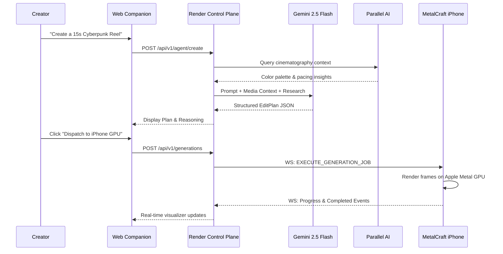

# MetalCraft — Gemini 2.5 Flash Creative Director Orchestration

## 1. Role & Responsibilities
Google Gemini 2.5 Flash acts as the autonomous Creative Director and Lead Cinematographer in MetalCraft. It is responsible for:
- Parsing high-level aesthetic intent (e.g. "Create a 15-second cinematic cyberpunk product reel").
- Selecting appropriate Metal GPU color adjustments (exposure, contrast, saturation, temperature, tint, sharpness).
- Constructing a multi-scene timeline referencing assets by stable `assetId` (not mutable filenames).
- Determining whether Parallel AI external research is required for specialized cinematography context.
- Generating a matching `AudioPlan` specifying mood, volume, and fade durations.

## 2. Structured System Prompt & JSON Enforcement
Gemini is configured with `responseMimeType: "application/json"` and temperature `0.4` to produce predictable, schema-valid EditPlans adhering strictly to `schemaVersion "1.0"`.

